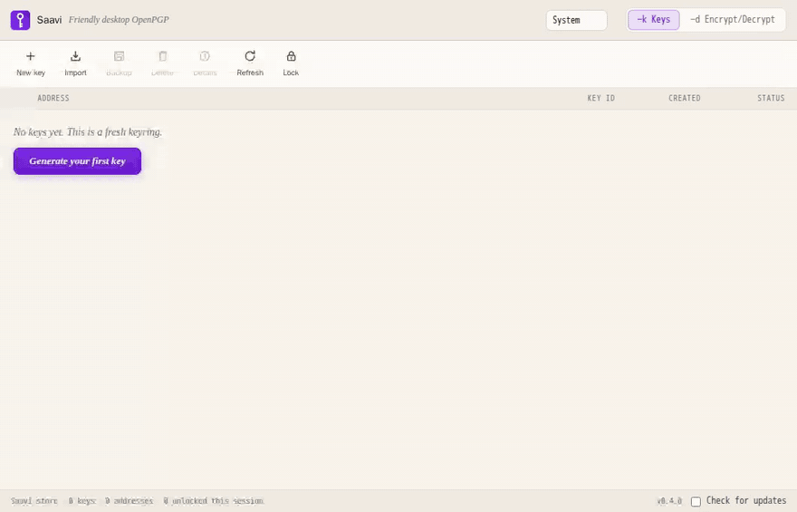
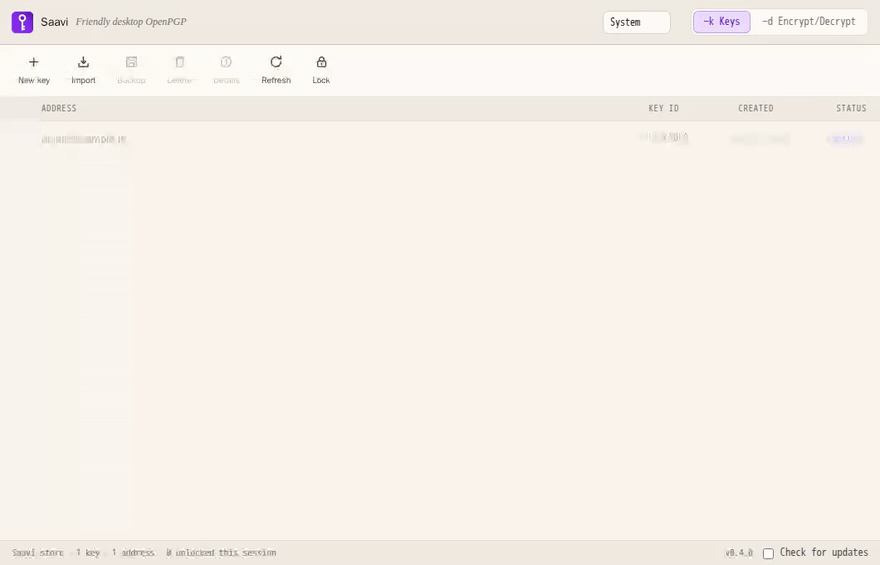

#  Saavi

**Saavi** (சாவி, Tamil for *key*) — friendly desktop OpenPGP.

A small, fast desktop app for OpenPGP keys and sealed text: generate,
import, back up and manage keys in a keyring you can actually read, and
encrypt/decrypt with them — to anyone whose key is discoverable over
[WKD](https://datatracker.ietf.org/doc/html/draft-koch-openpgp-webkey-service),
including Proton Mail users.

> The browser can't fully protect your keys; this is the app that can.
> Web-based E2EE lives inside a browser profile where any extension with
> site access can watch the page. Saavi is a native shell with no
> extension ecosystem: your keys live on your device, locked with your
> passphrase, and nothing else is in the room.

Saavi is a sibling of [Muthirai](https://github.com/kaditham-technologies/muthirai)
(the seal) and [Kaditham Mail](https://mail.kaditham.ie) (the letter). It
works fully standalone — no account, no server — and pairs with Kaditham
Mail if you have it.

## What it looks like

**Your first key** — an empty keyring to a usable key. Six random words are
suggested as the passphrase; nothing else is asked for.



**Sealing a letter** — encrypt to an address, then read it back with its
signature verdict. Both are longer to describe than to do.



Both are recordings of the real app, generated by
[`docs/screenshots/walkthroughs.js`](docs/screenshots/walkthroughs.js).

## Trust boundary

- **Keys are generated on your device** (OpenPGP.js, OS-grade randomness)
  and never leave it, except as a passphrase-locked backup file you
  download yourself.
- **Private keys are passphrase-locked at rest** (OpenPGP S2K, armored);
  addresses and public keys sit beside them in the clear. Unlocked keys
  exist only in process memory, and are dropped after 15 idle minutes or
  with **Lock** (⌘L / Ctrl+L).
- **Recipient keys are remembered, and a change stops the seal.** In the
  Saavi store, the first key found for an address is pinned and its
  fingerprint shown once — the one moment it can still be checked out of
  band. If that address later answers with a different key, sealing stops
  until you accept the new fingerprint, and declining sends nothing to
  anyone: no partial send reaches some recipients and silently drops the
  rest. A key that was published and then withdrawn refuses rather than
  falling back to the remembered one. Pins are public keys, listed under
  **Known addresses** on the Keys tab, and forgettable. System GnuPG mode
  uses gpg's own web of trust instead.
- **Only public keys ever travel** — the app's network use is fetching
  other people's public keys over WKD (in system mode, gpg's own
  `--auto-key-locate wkd`), plus, only if you tick **Check for updates**,
  one daily GET of the release manifest from kaditham.ie — no identifiers,
  nothing downloaded or installed. Nothing is uploaded.
- **System GnuPG mode adds no new key handling.** Saavi runs `gpg`; it
  does not read `~/.gnupg`, hold secret keys, or see passphrases.
- **What Saavi cannot protect against:** a compromised operating system,
  or someone with your passphrase and your device. There is no key escrow
  and no recovery; the backup file and passphrase are the whole story.

## Two keyrings

| Source | Where keys live | Needs |
|---|---|---|
| **Saavi store** (default) | Saavi's own passphrase-locked store, via OpenPGP.js | nothing — works on any machine |
| **System GnuPG** | your real `~/.gnupg`: the keys git, pass, mutt and Kleopatra use | GnuPG installed (Gpg4win, GPG Suite/Homebrew, or your distro's package) |

In system mode Saavi is a face for **your own `gpg`**: every operation is
the gpg binary with a fixed argument set; listing is `--with-colons`,
outcomes come from `--status-fd`. gpg-agent and your pinentry handle
passphrases (and smartcards), so Saavi never sees them. Trust is gpg's web
of trust: an untrusted recipient key is refused until you say "this once",
and every unsealed message shows gpg's signature verdict — who signed,
fingerprint, and how far you trust that key. Saavi will not delete secret
keys from the GnuPG keyring.

## The two faces (KGpg heritage)

| Mode | What it is |
|---|---|
| **−k Keys** | The keyring: a table of every key — address, key ID, created, status/trust, secret-key presence — with New / Import / Backup / Delete / Details on a toolbar. Details shows fingerprint, subkeys, user IDs, and (system keyring) lets you set expiry, change passphrase, add or revoke user IDs, set owner trust, certify keys, fetch from keys.openpgp.org. |
| **−d Encrypt/Decrypt** | The sealer: paste or type text, name recipients, choose whether to sign, then Seal, Unseal, Sign (clearsign) or Verify. Addresses (WKD / keys.openpgp.org lookup) and pasted keys mix freely in the To field — several of each if you like, and every one is a recipient. Every seal, signed or not, also goes to one of your own keys, so what you send stays readable to you. Drop a file on the window to seal it; drop a `.gpg` to unseal. Signature verdicts are shown on every unseal and verify. |

Tired of typing it? Tick **remember in the OS keychain** when unlocking
and Saavi opens the key through macOS Keychain / Windows Credential
Manager / your Linux keyring instead — per key, opt-in, reversible.

First key? The wizard starts you with **six random words** from the EFF
list (about 77 bits) already filled in — copy them into a password manager
(KeePassXC, Bitwarden, Apple Passwords) or type your own. Saavi will not
try to be one.

## Build

Frontend (any machine with Docker, no local Node needed):

```sh
docker run --rm -u $(id -u) -v "$PWD":/app -w /app node:22-alpine npm ci
docker run --rm -u $(id -u) -v "$PWD":/app -w /app node:22-alpine npm run build
```

Desktop shell (needs Rust + platform webview headers; on Debian/Ubuntu:
`libwebkit2gtk-4.1-dev build-essential libssl-dev libdbus-1-dev`):

```sh
cargo install tauri-cli --version '^2'
cargo tauri build        # or: cargo tauri dev
```

## License

MIT — see [LICENSE](LICENSE). Crypto policy: OpenPGP operations go through
[OpenPGP.js](https://github.com/openpgpjs/openpgpjs) only; PRs adding
bespoke or additional crypto implementations will be declined
(see [CONTRIBUTING](CONTRIBUTING.md)). Third-party licenses, including
OpenPGP.js (LGPL-3.0-or-later), are listed in
[THIRD-PARTY-NOTICES.md](THIRD-PARTY-NOTICES.md).

## More

- [CHANGELOG](CHANGELOG.md) · [Roadmap](docs/ROADMAP.md) · [Parity with Kaditham Mail](docs/PARITY.md) · [Distribution](docs/DISTRIBUTION.md)
- [Contributing](CONTRIBUTING.md) · [TODO / hardening backlog](TODO.md) · [Security policy](SECURITY.md) · [Code of conduct](CODE_OF_CONDUCT.md)
- Downloads: [GitHub releases](https://github.com/kaditham-technologies/saavi/releases)
  (Linux `.deb`/`.AppImage`, macOS `.dmg`, Windows `.msi`/`.exe` — all
  GPG-signed, with `SHA256SUMS.asc` and `latest.json`), mirrored
  at [kaditham.ie/saavi](https://kaditham.ie/saavi/). Every release carries a clearsigned verification
  note; the signing-key fingerprint is published on the website too.

---

MIT licensed. © Kaditham Holdings Pte Ltd · built by Kaditham Technologies Limited.
